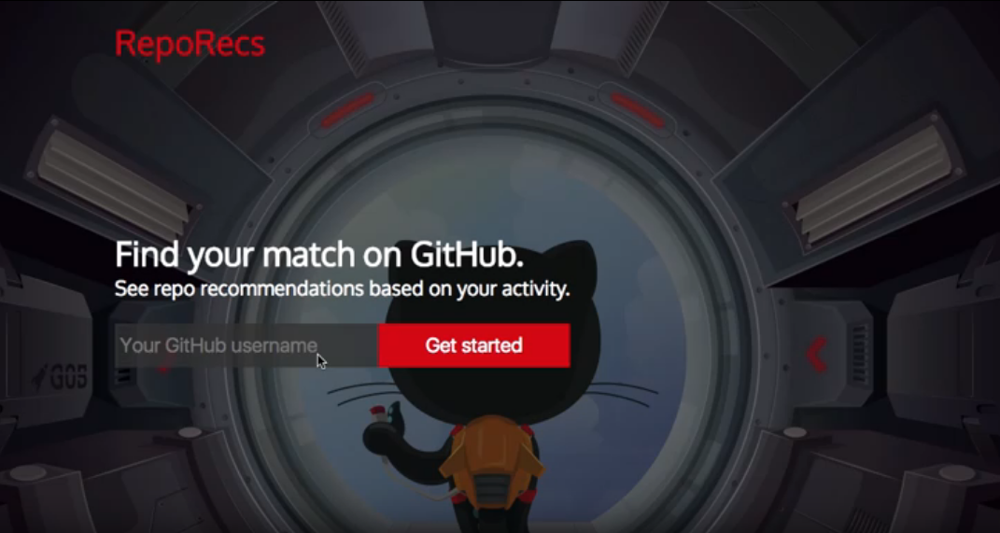
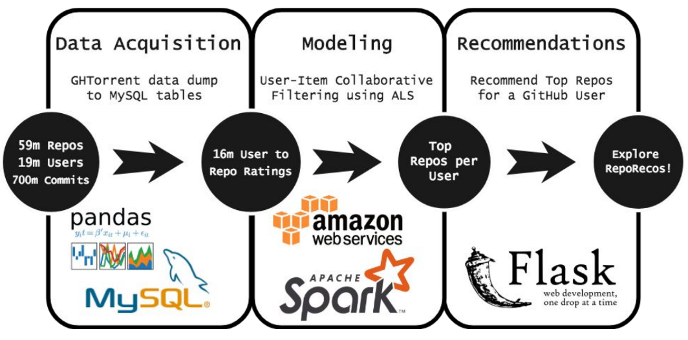

# RepoRecs

### Using Alternating Least Squares Matrix Factorization to Collaboratively Filter Repo Recommendations

Finding open source projects to work on can be a daunting task if you're new to the GitHub community, or even an established contributor who needs a fresh project to work on. GitHub's search yields the top starred repos by keyword, so are not always the repos most similar to repos you've contributed to in the past. RepoRecs is the sieve which sifts through both popular and smaller projects and offers repo recommendations based on the  interests of users similar to you.

In the current iteration of RepoRecs, the log of the number of commits a user makes to a repo (including forked repos) is used as implicit data to determine a user's interest in each repo. Using ALS matrix factorization in Spark, we find other users with similar interest levels in the same repos and recommend those repos the original user has not yet contributed to.

### Project Pipeline

### Future Work
In future versions of RepoRecs, looking at repo content similarity should help connect users who have not collaborated on any projects (users who only host their own projects but have not forked anything). I'm also interested in building a graph of the GitHub community so that users can visually explore their local GitHub community and find other users and their projects, as well as delineate communities based on their [Girvan-Newman](https://en.wikipedia.org/wiki/Girvan%E2%80%93Newman_algorithm) betweeness centrality.

### Data Source
The data used for this project was downloaded through the [GHTorrent](http://ghtorrent.org/) project.

Repos marked as being 'deleted', and users marked as being 'fake' by the GHTorrent dataset were queried out and not used.

### Slides
[Slides from Galvanize Capstone Project Showcase](https://github.com/caitriggs/github-collaborator/blob/master/RepoRecs-SlideDeck.pdf)
